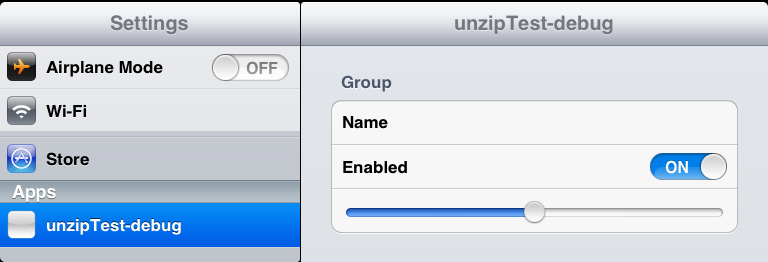

# Native Utils - iOS Air Native Extension
*author: Paweł Meller*

This extension currently provides access to:

- Settings Bundle
- Unzipping a .zip file to specified location (using SSZipArchive)
- NSLog

# Settings Bundle #

[docs on developer.apple.com](http://developer.apple.com/library/ios/#DOCUMENTATION/Cocoa/Conceptual/UserDefaults/Preferences/Preferences.html)

*Usage:*

    //Add Settings.bundle (yes, on windows it is a directory) to your application and include it in building options
	if(NativeUtils.isSupported)
	{
		var nativeUtils:NativeUtils=new NativeUtils();
	//you should alwas load defaults before accesing the values, this will not override any values, that are already set
	//if you don't load the defaults the application may crash when trying to access a value, that was not set
		nativeUtils.settings.loadSettingsDefaults();
	//if you want to retrieve a string:
		var mySetting:String=nativeUtils.settings.getStringValue("settingKeyFromBundle");
	//if you want to retrieve a number:
		var mySetting:Number=nativeUtils.settings.getNumberValue("settingKeyFromBundle");
	//if you want to retrieve an int:
		var mySetting:Int=nativeUtils.settings.getIntValue("settingKeyFromBundle");
	//if you want to retrieve a Boolean:
		var mySetting:Number=nativeUtils.settings.getBooleanValue("settingKeyFromBundle");
	//you can also set the values by using
		nativeUtils.settings.setStringValue("settingKeyFromBundle","my value");
		nativeUtils.settings.setNumberValue("settingKeyFromBundle",.52);
		nativeUtils.settings.setIntValue("settingKeyFromBundle",134);
		nativeUtils.settings.setBooleanValue("settingKeyFromBundle",true);
	//in iOS >5 synchronize should be called automatically, but you can also do this manually to commit the changes
		nativeUtils.settings.synchronize()
	}

# Unzip #
A simple unzipping function - had to do this, because all of the zip libraries for as3 that i found had problems with unpacking large files on iPad 1
source: [github](https://github.com/samsoffes/ssziparchive)

*Usage:*

	var _nativeUtils:NativeUtils;
	if(NativeUtils.isSupported)
	{
	if(!_nativeUtils)
	_nativeUtils=new NativeUtils();
	_nativeUtils.addEventListener(NativeUtilsZipEvent.PROGRESS,unpackProgress);
	_nativeUtils.addEventListener(NativeUtilsZipEvent.COMPLETE,unpackComplete);
	_nativeUtils.unzipFile(path,File.applicationStorageDirectory.nativePath);
	}
Progress And Complete:

	//Event Listeners:
	private function unpackProgress(e:NativeUtilsZipEvent)
	{
	//gives progress of unzipping (0-100)
	trace(e.percentage);
	}
	private function unpackComplete(e:NativeUtilsZipEvent):void
	{
	_nativeUtils.removeEventListener(NativeUtilsZipEvent.PROGRESS,unpackProgress);
	_nativeUtils.removeEventListener(NativeUtilsZipEvent.COMPLETE,unpackComplete);
	}

# NSLog #
Ever wanted to do trace on iOS without connecting to debugger? Now you can, install a system console
(i'm using [this one](http://itunes.apple.com/pl/app/system-console/id431158981?mt=8 "this one")) and see every trace from your application.

*Usage:*

 	var nativeUtils:NativeUtils=new NativeUtils();
 	nativeUtils.nslog("Your message");
